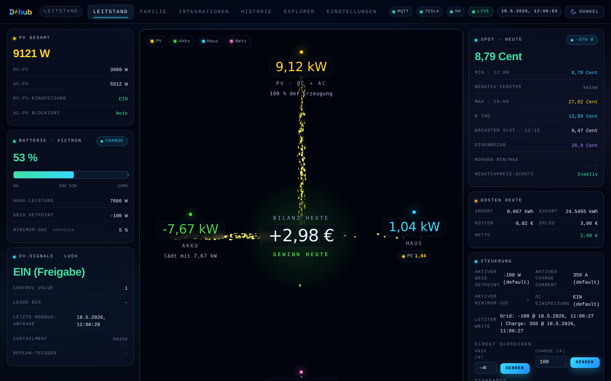
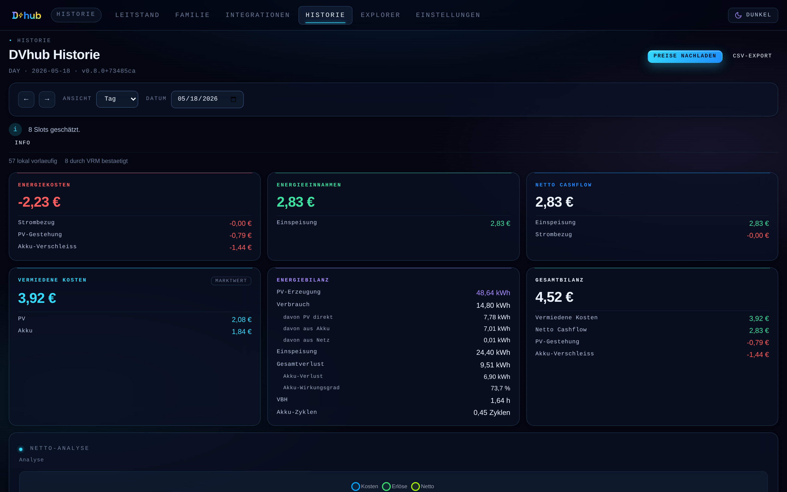
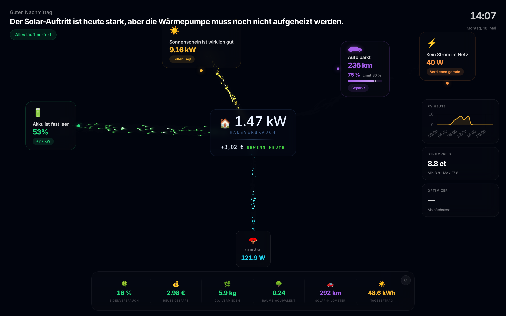

<p align="center">
  
</p>

```
██████╗ ██╗   ██╗██╗  ██╗██╗   ██╗██████╗
██╔══██╗██║   ██║██║  ██║██║   ██║██╔══██╗
██║  ██║██║   ██║███████║██║   ██║██████╔╝
██║  ██║╚██╗ ██╔╝██╔══██║██║   ██║██╔══██╗
██████╔╝ ╚████╔╝ ██║  ██║╚██████╔╝██████╔╝
╚═════╝   ╚═══╝  ╚═╝  ╚═╝ ╚═════╝ ╚═════╝
```

<p align="center">
  <strong>Hack the Grid</strong><br/>
  Direktvermarktung als Software — ohne neue Hardware.
</p>

> **DVhub** macht eine bestehende Victron-ESS-Anlage direktvermarktungs-tauglich:
> Es bildet die PLEXLOG-kompatible Modbus-Schnittstelle des Direktvermarkters in
> Software nach und erweitert sie zu einem vollwertigen Home Energy Management
> System (HEMS) — mit Web-Leitstand, Day-Ahead-Börsenautomatik, Prognose- und
> Optimierungs-Engine, Telemetrie-Historie und Familien-Dashboard. Alles läuft
> auf eigener Linux-Hardware, ohne Cloud-Zwang. Getestet mit LUOX Energy
> (ehem. Lumenaza) als Direktvermarkter.

<p align="center">
  <strong>0 € Zusatz-Hardware</strong> &nbsp;·&nbsp; <strong>1 Befehl zur Installation</strong> &nbsp;·&nbsp; <strong>100 % auf eigener Hardware</strong>
</p>

| | |
|---|---|
| **Status** | Version 1.0.6 „Sushi" — feature-complete, Wartungs-Release (Historie-Performance, AC-PV-Positionen) |
| **Getestet mit** | LUOX Energy · Victron Ekrano-GX / Cerbo-GX · Fronius AC-PV |
| **Plattform** | Debian/Ubuntu (x86_64) · Node.js 22 · PostgreSQL |
| **Lizenz** | Energy Community License (ECL-1.0) — siehe [Lizenz](#lizenz) |
| **Drittlizenzen** | [`THIRD-PARTY-LICENSES.md`](THIRD-PARTY-LICENSES.md) |

<p align="center">
  
  <br/>
  <em>Leitstand — Live-Dashboard mit Energy-Flow-Visualisierung, Day-Ahead-Preisen und Steuerung</em>
</p>

---

## Kurzüberblick

DVhub ersetzt bzw. ergänzt einen physischen Plexlog als DV-Schnittstelle: Die
Modbus-Kommunikation des Direktvermarkters wird in Software nachgebildet, während
die Live-Werte direkt vom Victron-GX-System kommen. Darüber hinaus ist DVhub zu
einem vollwertigen HEMS ausgebaut.

- **DV-Schnittstelle** *(DVhub Pro)* **und Web-Leitstand** in einer Anwendung — keine zusätzliche Hardware
- **Dashboard** mit Energy-Flow-Visualisierung, Live-Werten, Day-Ahead-Preisen und Steuerung
- **Kleine Börsenautomatik** mit zweistufigem Forecast-aware-Modus (Stufe 2: vorausschauendes Akku-Leeren)
- **Prognose-Engine** — PV-Ertrag (pvlib), Lastvorhersage und Multi-Modell-Ensemble mit Accuracy-Tracking
- **Optimierung** — freie kleine Börsenautomatik (Greedy/MILP-Abend-Slots) plus der **Akkudoktor-EOS-Arbitrage-Optimizer** *(DVhub Pro)* (DV-Direktvermarktungs-Fork, 15-Minuten-Slots, standardmäßig mitinstalliert)
- **Optionale ML-Prognose-Korrektur** — selbstlernende Korrektur systematischer Prognosefehler (LightGBM)
- **Historie** mit PostgreSQL-Telemetrie, Finanz-Karten und 14 Visualisierungs-Karten
- **Familien-Dashboard** als haushaltstaugliche Übersicht inkl. Tesla-/Haus-Flow und Screensaver *(DVhub Pro)*
- **Integrationsplattform** für Home Assistant, Loxone, EOS, EMHASS, evcc, MQTT und TeslaMate
- **DVhub Price Feed** (dvhub.online) als zentraler Preisfeed für alle EPEX-Preiszonen
- **VPN-Manager** für OpenVPN-/WireGuard-/IPsec-Tunnel zum Direktvermarkter *(DVhub Pro)*

## Inhaltsverzeichnis

- [Schnellstart](#schnellstart)
- [Funktionsumfang (Community)](#funktionsumfang-community)
- [DVhub Pro](#dvhub-pro)
- [Oberflächen](#oberflächen)
- [Prognose, Optimierung &amp; Steuerintelligenz](#prognose-optimierung--steuerintelligenz)
- [Integrationen](#integrationen)
- [DVhub Price Feed](#dvhub-price-feed)
- [Sicherheit &amp; Betrieb](#sicherheit--betrieb)
- [Direktvermarktung kompakt](#direktvermarktung-kompakt)
- [Installation im Detail](#installation-im-detail)
- [API und Konfiguration](#api-und-konfiguration)
- [Changelog](#changelog)
- [Lizenz](#lizenz)

---

## Schnellstart

### Installer

**Stable (empfohlen):**

```bash
curl -fsSL https://raw.githubusercontent.com/chloepriceless/dvhub/main/install.sh | sudo bash
```

**Dev (Bleeding Edge — aktuelle Commits von main):**

```bash
curl -fsSL https://raw.githubusercontent.com/chloepriceless/dvhub/main/install.sh | sudo bash -s -- --channel dev
```

Der Installer:

- installiert Node.js 22 (nur falls keine Node ≥ 18 vorhanden ist), PostgreSQL, die VPN-Pakete (OpenVPN, WireGuard, strongSwan) sowie `python3-venv`, `python3-pip`, `autossh` und `openssh-client`
- legt PostgreSQL-User und Datenbank `dvhub` an (Peer-Auth via Unix-Socket)
- klont das Repo nach `/opt/dvhub` und betreibt die App unter `/opt/dvhub/dvhub`
- generiert automatisch einen `apiToken` und ein selbstsigniertes TLS-Zertifikat
- richtet einen systemd-Service mit Selbstheilung beim Start ein (`post-update.sh` als `ExecStartPre`)
- nutzt eine externe Config unter `/etc/dvhub/config.json`
- installiert den vollen Prognose-/ML-Stack hash-gepinnt aus `requirements.lock` (auf jeder Box) und zusätzlich Akkudoktor-EOS ab ≥ 1 GB RAM (siehe **Leistungsstufen**)
- **Stable-Channel** (Standard): checkt den neuesten Semver-Release-Tag aus
- **Dev-Channel** (`--channel dev`): checkt `origin/main` HEAD aus
- **Commit-Pin** (`--ref <commit|tag>`): checkt exakt diesen Stand aus — für
  Beta-Tests („bitte Commit `abc1234` testen") und reproduzierbare
  Installationen. Die Ref muss vom Release-Branch erreichbar sein; das nächste
  Update über die Einstellungen löst den Pin wieder auf den Channel auf
- der Update-Channel ist nachträglich über die Einstellungen umschaltbar
- legt **standardmäßig** einen Fern-Support-Login-User `dvhub-support` (Gruppe `dvhub`, **kein sudo**) an und hinterlegt den öffentlichen Support-Schlüssel — als Bereitschaft für Fern-Diagnose. **Wichtig:** Das gibt dem Support **keinen** Zugriff. Erreichbar ist die Box nur, solange **du** in den Einstellungen aktiv einen zeitbegrenzten Support-Tunnel öffnest (jederzeit abbrechbar). Abschaltbar mit `--no-support-user`.

**Ohne Akkudoktor-EOS (Opt-out):**

```bash
curl -fsSL https://raw.githubusercontent.com/chloepriceless/dvhub/main/install.sh | sudo bash -s -- --no-eos
```

Akkudoktor-EOS wird **standardmäßig mitinstalliert** — als DVhubs eigener
**Direktvermarktungs-Fork** (DV-EOS: 15-Minuten-Slots, slot-genaue Batterie-/
Wechselrichter-Mathematik, Akku→Netz-Arbitrage) als eigener Dienst unter
`127.0.0.1:8503`, sofern ≥ 1 GB RAM verfügbar sind. Mit `--no-eos` lässt sich das
überspringen (z. B. auf RAM-armen/Headless-Boxen); die interne MILP-/Heuristik-
Optimierung läuft auch ohne EOS. (`--with-eos` bleibt als kompatibler No-op
erhalten, da EOS jetzt Default ist.)

**Ohne Fern-Support-User (Opt-out):**

```bash
curl -fsSL https://raw.githubusercontent.com/chloepriceless/dvhub/main/install.sh | sudo bash -s -- --no-support-user
```

> Flags sind kombinierbar, z. B. `--channel dev --no-eos --no-support-user`.

Nach der Erstinstallation (bzw. wenn die Config fehlt/ungültig ist) öffnet DVhub beim ersten Aufruf unter `/` automatisch den Onboarding-Assistenten (`onboarding.html`) — ein manueller Aufruf einer Setup-Seite ist nicht nötig.

### Leistungsstufen (RAM-Tiers)

DVhub skaliert mit der verfügbaren Hardware. Der Installer erkennt den RAM und
installiert nur die Komponenten, die das System tragen kann:

| Stufe | RAM | Funktionen |
|-------|-----|------------|
| **Vollständig** | ≥ 1 GB | Kern-DV, Steuerung, Telemetrie, Börsenautomatik, **voller Prognose-/ML-Stack** (pvlib, scikit-learn, LightGBM, statsforecast — hash-gepinnt aus `requirements.lock`, auf jeder Box) **und Akkudoktor-EOS** (DVhub-Direktvermarktungs-Fork) als externer Optimizer-Dienst — standardmäßig mitinstalliert, opt-out mit `--no-eos` |
| **Ohne EOS** | < 1 GB | wie oben, aber **ohne EOS** (zu RAM-hungrig unter 1 GB); die interne MILP-/Heuristik-Optimierung + kleine Börsenautomatik laufen weiter |

> Hinweis: Ein früher dokumentierter Edge-LLM-Layer (Ollama/TinyLlama für
> Kachel-Erläuterungen) ist in v1.0 nicht mehr Bestandteil von DVhub und wird vom
> Installer nicht eingerichtet.

### Erster Aufruf

Der Installer betreibt den Webserver auf **Port 80** (HTTP) und **Port 443**
(HTTPS, selbstsigniertes Zertifikat); das `node`-Binary erhält dafür
`cap_net_bind_service`. Der HTTP-Port ist über `httpPort` in der Config frei
wählbar (Code-Default ohne Beispiel-Config: `8080`).

- Leitstand: `http://<host>/`
- Familie: `http://<host>/family` *(DVhub Pro)*
- Integrationen: `http://<host>/integrations`
- Historie: `http://<host>/history.html`
- Explorer: `http://<host>/explorer.html`
- Einstellungen: `http://<host>/settings.html`
- API-Dokumentation: `http://<host>/api-docs.html`
- Onboarding-Assistent: wird nach der Erstinstallation automatisch unter `http://<host>/` angezeigt (`onboarding.html`); die ausführliche Setup-Seite (`http://<host>/setup.html`) bleibt direkt erreichbar

---

## Funktionsumfang (Community)

Alle hier gelisteten Funktionen sind in der freien **ECL-1.0**-Edition ohne
Lizenzschlüssel nutzbar. Die wenigen lizenzpflichtigen Komfort-Features stehen
separat unter [DVhub Pro](#dvhub-pro).

### Direktvermarktung &amp; Steuerung

- **DV-Modbus-Server** auf Port `1502` (Default `modbusListenPort`) mit FC3/FC4 Read und FC6/FC16 Write — PLEXLOG-kompatibel *(DVhub Pro — die DV-Schnittstelle; ohne Lizenz startet der Server nicht. Der Victron-Modbus-CLIENT + Steuerpfad unten bleiben frei.)*
- **LAN-only-Zugriffsschutz** für den Modbus-Server: nur Loopback + RFC1918 (oder eine explizite `modbusAllowedClients`-Allowlist); fremde Clients werden sofort getrennt und protokolliert
- **DV-Signalerkennung** mit Lease-Logik (`offLeaseMs`) und automatischer, sicherer Rückkehr in Freigabe nach Ablauf
- **Victron-Steuerung** für Grid Setpoint, Charge Current, Min SOC, Max Discharge sowie die DC-/AC-Einspeise-Flags (`feedExcessDcPv`, `dontFeedExcessAcPv`)
- **Transport wahlweise Modbus TCP** (On-Demand-Client mit Connection-Pool und Connect-Timeout-Guard) **oder MQTT** (Venus OS, mit Keepalive und Cache-Frische-Prüfung)
- **Universal-MQTT-Schnittstelle** — Herstellerprofil „Universal (MQTT-Bridge)" (`hersteller/bridge-mqtt.json`): jeder nicht nativ unterstützte Wechselrichter (Deye, Growatt, …) wird über eine kleine MQTT-Bridge angebunden, die das dokumentierte Venus-Topic-Schema spricht; Broker und Portal-ID sind direkt in den Einstellungen konfigurierbar — [Anleitung mit Node-RED-Referenz-Flow](docs/DEYE-NODERED-BRIDGE.md)
- **Negativpreis-Schutz** — blockiert die Einspeisung automatisch, sobald der EPEX-Preis < 0 ct/kWh fällt
- **Rechtliches Schreibgate (EEG/§14a)** — Netzladen bzw. erzwungene Netzentladung nur bei freigegebenen Flags (`allowGridCharge`/`allowGridDischarge`)
- **Universeller Entlade-Boden** — kein entlade-aktivierender Write, wenn der SOC unbekannt, veraltet oder ≤ Hartboden (`hardFloorSocPct`) ist
- **Sell-Price-Floor** — verhindert das Verschleudern von Akku-Energie unterhalb eines konfigurierbaren Mindest-Verkaufspreises
- **reg-2700/2716-Keepalive** — verlorene ESS-Setpoints (GX-Reboot/Watchdog) werden automatisch erneut gesetzt
- **Selektiver Not-Halt** — pausiert alle diskretionären Writes; nur Sicherheits-Pflichtquellen (Negativpreis-Schutz, SOC-Floor, Not-Halt selbst) schreiben weiter. Der Zustand wird atomar persistiert und überlebt einen Service-Neustart
- **Day-Ahead-Preis-Engine** mit Heute-/Morgen-Daten, Hover-Details und Chart-Auswahl
- **Schedule-System** mit Defaults, manuellen und persistenten Overrides sowie Chart-zu-Schedule-Auswahl
- **Kleine Börsenautomatik** für automatische Entladung in Hochpreisphasen — energiebasierte Slot-Allokation, dynamischer sonnenstandsabhängiger SOC-Floor und wahlweise Greedy- oder MILP-Engine
- **Forecast-aware Börsenautomatik (Stufe 2)** — leitet Reserve und Hoarding-Gate aus dem PV-/Last-Forecast der nächsten 24 h ab (Über-Nacht-SOC-Schutz, `forecastAware`). *(„Forecast Aware++"/Stage 2++ — das vorausschauende aktive Akku-Leeren — wurde **entfernt** und in der UI ausgeblendet; die EOS-Arbitrage ist der produktive Nachfolger. Der Code bleibt mitinstalliert.)*
- **DC-Export-Modus (100 % Einspeisung)** mit Live-Hausverbrauchs-Abzug (`subtractHouseLoad`) und SOC-/Deadline-Schutz vor dem Abend-Peak
- **§51-EEG Förderzeitraum-Verlängerungs-KPI** aus den Negativpreis-Viertelstunden (Solarspitzengesetz)
- **Victron-Alarm-Banner** — read-only Anzeige aktiver VE.Bus-/BMS-Alarme im Status, entkoppelt vom Steuerpfad
- **Kosten- und Preislogik** für Netz, PV und Akku über `userEnergyPricing`, inkl. datumsbasierter Bezugspreise und §14a Modul 3

### Prognose &amp; Optimierung

- **PV-Ertragsprognose** über pvlib mit standort- und anlagenspezifischen Parametern
- **Multi-Provider-Ensemble** — kombiniert pvlib, Solcast, pvnode.de, forecast_solar, Open-Meteo und VRM, gewichtet nach rollierendem Prognosefehler (inverse MAE); fehlende Provider renormalisieren automatisch
- **Lastvorhersage** über statistische Modelle (statsforecast) mit SQL-Wochentag-Fallback
- **Nebel-Korrektur** und **Accuracy-Tracking** — jede Prognose wird als Snapshot gespeichert und gegen die Messwerte ausgewertet
- **Optionale ML-Korrektur** (`ml.mlEnabled`) — selbstlernendes LightGBM-Modell korrigiert systematische Prognosefehler, mit atomarem Modell-Swap, Schema-Guard und automatischem Sanity-Fallback auf die Rohprognose
- **Optimizer-Dispatch** *(DVhub Pro)* — MILP-Batterieoptimierung über den HiGHS-Solver (15-Minuten-Slots) mit schneller Heuristik als Fallback; der `internal`-Modus ist Teil des Pro-Optimizer-Layers (`services/optimizer`) und geht ohne Lizenz mit aus. Die freie kleine Börsenautomatik oben nutzt ihre eigene Engine
- **Akkudoktor-EOS-Anbindung** *(DVhub Pro — Arbitrage)* (standardmäßig mitinstalliert als DVhub-Direktvermarktungs-Fork; opt-out `--no-eos`) — externer Optimizer-Dienst mit Config-Sync, Forecast-Bridge (Selbstheilung nach EOS-Neustart) und Akku→Netz-Arbitrage; **ohne aktive Lizenz aktuiert EOS nicht** (automatischer Fallback auf Stufe 1/2, Prognosewerte bleiben sichtbar)
- **Marktprämien-Modulation** (optional, `optimizer.tariff.feedInIncludeMarketPremium`) — bewertet die Einspeisung am realen Direktvermarktungs-Margin (Spot + Marktprämie) statt am Rohspot; §51-konform (keine Prämie in Negativpreis-Slots)
- **Quellen-Selektor** `best`/`internal`/`eos` *(DVhub Pro)* — wählt anhand einer Netzkosten-Schätzung den günstigeren Plan (Teil des Pro-Optimizer-Layers)
- **MiSpeL-Guard** — setzt das §14a-konforme Netzlade-Verbot durch (außer bei lizenzierter Arbitrage)
- **Abgeregelte Energie** — strahlungskalibrierte Schätzung des durch §51/Direktvermarkter gedrosselten Stroms — [in einfacher Sprache erklärt](dvhub/docs/ABREGELUNG-ERKLAERT.md)

### Daten, Historie &amp; Observability

- **PostgreSQL-Telemetrie** mit Persistenz, Rollups, historischem Nachimport und Retention
- **TimescaleDB optional** — bei aktiviertem `telemetry.database.timescaledb` ersetzen Continuous Aggregates &amp; Retention die App-Rollups; fehlt die Extension, fällt DVhub automatisch auf App-Rollups zurück
- **History-Visualisierung** mit **14 Analyse-Karten** und CSV-/Parquet-Export
- **Prometheus-Metriken** unter `/api/metrics` (prom-client)
- **VRM-History-Import** zum Nachfüllen von Telemetrie-Lücken
- **DB-Backup** — Download-Stream (`pg_dump`) und geplantes tägliches Backup mit Retention; Ziel wahlweise lokales Verzeichnis oder SMB/CIFS-Share

### Integrationen &amp; Plattform

- **Home Assistant** (JSON-Endpunkt + MQTT-Auto-Discovery), **Loxone** (Textformat), **EOS**, **EMHASS**, **evcc**, **TeslaMate**
- **Eingebauter MQTT-Broker** (aedes, gebunden auf Loopback) + Publisher + MQTT-Inspector
- **Geräte-Schaltung** über Shelly-HTTP- und MQTT-Generic-Adapter (Live-Leistung + schaltbares Relais)
- **Benachrichtigungen** über **Telegram, Pushover und ntfy**; separater **Uptime-Kuma-Heartbeat** (signiert, SSRF-geschützt)
- **VPN-Manager** *(DVhub Pro)* für OpenVPN-/WireGuard-/IPsec-Tunnel zum Direktvermarkter — mit Direktiven-Härtung, Cert-Expiry-Check und Watchdog (benötigt eine aktive DVhub-Pro-Lizenz)
- **Fern-Support** — kundeninitiierter, zeitbegrenzter Reverse-SSH-Tunnel (Kill-Switch) und Support-Bundle-Download

### Betriebsmodell

- **Externe Konfiguration** statt fest eingebauter Runtime-Dateien
- **Hersteller-Adapter** entkoppeln gerätespezifische Register/Endpunkte vom Kern
- **Härtbare Sicherheits-Posture** — `security.lanTrust` (open/restricted/strict) plus Host-/CORS-/Proxy-Allowlists für öffentlich erreichbare Deployments
- **systemd-ready** für dauerhaften Betrieb, Health-/Service-Status in den Einstellungen, Restart aus der GUI
- **Modulare Architektur** mit Factory-Modulen, Service-Layer und DI-Context-Pattern

---

## DVhub Pro

DVhub ist vollständig unter der ECL-1.0 nutzbar. Ausgewählte Komfort-Features
sind hinter eine optionale **DVhub-Pro-Lizenz** gestellt (selbst gehostetes
**Keygen CE**). Diese Features erfordern eine aktive Lizenz. Der LAN-Bypass von
DVhub betrifft ausschließlich die API-Token-Authentifizierung (Clients im eigenen
Netz brauchen keinen Bearer-Token) — die Pro-Lizenzprüfung läuft davon unabhängig.

### Was ist Pro?

Die beiden **Kern-Direktvermarktungs-Funktionen** und drei Komfort-Features sind
lizenzpflichtig und werden **serverseitig** durchgesetzt (nicht nur in der UI
versteckt). Das Code-Gating (`requirePro()` für HTTP, `isProActive()` für die
Live-Dienste) und die Frontend-Whitelist `ALLOWED_FEATURES` sind deckungsgleich:

| Feature (intern) | Oberfläche / Funktion | Ohne Lizenz |
|---|---|---|
| `dv-interface` | **DV-Schnittstelle** = Modbus-SERVER (Port 1502) für den Direktvermarkter + HTTP-Read `/dv/control-value` | Server **startet nicht / bleibt komplett geschlossen**; der Victron-Modbus-**CLIENT** und alle anderen Anlagen-Integrationen laufen unverändert weiter |
| `eos` | **EOS / DV-EOS** Arbitrage-Optimizer-Dispatch (`services/optimizer`, `primarySource=eos`) | EOS **aktuiert nicht** → automatischer Fallback auf die freie kleine Börsenautomatik (Stufe 1/2); Prognosewerte bleiben sichtbar |
| `family-dashboard` | Familien-Dashboard (`/family` + alle `/api/family/*`-Routen) | `403 pro_required` + 🔒-Badge in der Top-Nav, Klick öffnet das Pro-Modal |
| `vpn-manager` | Einstellungen → VPN (`/api/vpn/*` — Status, Profil-Upload, Start/Stop/Restart) | `403 pro_required`; Tab zeigt Pro-Hinweis mit Lizenz-Link |
| `forecast-inspector-ml` | Einstellungen → Forecast → ML-Korrektur-Inspector | `403` + Pro-Banner inline, CTA öffnet das Pro-Modal |
| `forecast-inspector-eos` | Einstellungen → Forecast → EOS-Output-Inspector (Teil von EOS-Pro) | dito |
| `history-multiperiod` | **Historie-Zeiträume** Woche/Monat/Jahr/Alle (`/api/history/summary\|viz/*\|export` mit `view≠day`) | `403 pro_required`; im Historie-Dropdown tragen die Zeiträume ein 🔒, Auswahl öffnet das Pro-Modal und springt zurück auf **Tag** — die **Tagesansicht bleibt frei** |

> **Frei (Community, ECL-1.0):** die kleine Börsenautomatik **Stufe 1**
> (Greedy/MILP-Abend-Slots) **und Stufe 2** (`forecastAware`, Über-Nacht-SOC-
> Reserve/Hoarding), Leitstand, **Historie-Tagesansicht**, **Prognose-Anzeige**
> (PV + Last), der Victron-**Client** und andere Anlagen-Integrationen,
> **Negativpreis-Schutz** und alle **Sicherheits-Gates** (EEG/§14a, SOC-/Entlade-
> Boden, Not-Halt).
>
> **Pro** schaltet die **DV-Schnittstelle** (Direktvermarkter-Modbus-Server), die
> **EOS-Arbitrage** und die **Historie-Zeiträume Woche/Monat/Jahr/Alle** frei —
> alle drei sind ohne Lizenz serverseitig aus (die Historie-Tagesansicht bleibt frei). „Stage 2++"
> (`predictivePreEmpty` / „Forecast Aware++", das nie produktive Morgens-Entleeren)
> wurde **entfernt** (in der UI ausgeblendet; EOS ist der Nachfolger) — der Code
> bleibt mitinstalliert.
>
> Das Pro-Gating prüft ausschließlich den Lizenzstatus (`active`) und gilt
> **netzwerkunabhängig** — auch im eigenen LAN sind die Pro-Features ohne aktive
> Lizenz nicht freigeschaltet. Der LAN-Bypass von DVhub betrifft nur die
> API-Token-Authentifizierung, nicht die Pro-Lizenz.

### Aktivierung

1. Lizenzschlüssel im Shop bestellen: **https://shop.dvhub.de** (Format `DVHB-XXXX-XXXX-XXXX-XXXX`).
2. **Einstellungen → Lizenz** öffnen (oder direkt `/settings.html#license`).
3. Schlüssel einfügen → **Aktivieren**. DVhub validiert gegen **https://license.dvhub.de** (Keygen CE); bei Erfolg flippt der Status-Chip auf **Aktiv**, die Pro-Features sind frei und die Family-Nav verliert ihr 🔒-Icon.
4. DVhub revalidiert die Lizenz alle ~6 h im Hintergrund; manuell via **Jetzt prüfen**.
5. **Lizenz entfernen** setzt den Status zurück auf **Keine Lizenz**; die Pro-Routen liefern wieder `403 pro_required`.

Headless-Aktivierung (z. B. für Provisioning):

```bash
curl -X POST http://127.0.0.1/api/license/activate \
  -H "Authorization: Bearer ${DVHUB_API_TOKEN}" \
  -H "Content-Type: application/json" \
  -d '{"key": "DVHB-XXXX-XXXX-XXXX-XXXX"}'
```

### Lizenz-Architektur (Kurzfassung)

- **Source of Truth** ist Keygen CE auf `license.dvhub.de` (Status `active`/`invalid`/`expired`/`suspended`). Der Kauf läuft über Polar (Webhook → Keygen); Polar ist nicht Source-of-Truth für die Aktivierung.
- **Floating-Modell ohne Machine-Pinning:** Ein Schlüssel darf auf beliebig vielen eigenen DVhub-Instanzen gleichzeitig aktiv sein (Test-LXC, Prod, Backup).
- **Offline-Survival:** Ist `license.dvhub.de` nicht erreichbar, läuft DVhub mit dem zuletzt persistierten `active`-Status weiter — ein Keygen-Ausfall sperrt dich nicht aus dem eigenen Dashboard aus.
- **Persistenz:** `${DV_DATA_DIR}/license_state.json` (Mode `0600`). Der Klar-Schlüssel verlässt den Server nie über die API — `GET /api/license/state` redacted ihn.
- **Config:** `licensing.keygenAccount` (Fallback `KEYGEN_ACCOUNT`-Env). Fehlt der Account-Slug, liefert die Aktivierung `503 keygen_account_not_configured`.

Ein neues Pro-Feature hängt sich an, indem es (1) `requirePro(req, res, '<feature>')`
an die Route hängt, (2) einen Eintrag in `FEATURE_BODY` (deutsche Modal-Microcopy)
ergänzt und (3) den Namen in `ALLOWED_FEATURES` aufnimmt.

---

## Oberflächen

Alle Oberflächen sind auf das **Aurora Design System** portiert — card-basiertes
Layout, einheitliche Tokens, responsiv bis 430 px Viewport. Die Topbar führt zu
**Leitstand**, **Familie**, **Integrationen**, **Historie**, **Explorer** und
**Einstellungen**.

### Leitstand (Dashboard)

Startseite unter `/`:

- DV-Schaltstatus und Börsenpreis mit Negativpreis-Schutz
- Energy-Flow-Visualisierung, Netzleistung pro Phase, Victron-Werte (SOC, Akku, PV) inkl. Alarm-Banner
- Day-Ahead-Chart mit Hover, Highlight und Schedule-Auswahl
- Kleine Börsenautomatik mit Planungsanzeige und Chart-Highlighting
- Steuerung mit aktiven Werten, Defaults und manuellen Writes
- Forecast- &amp; Energiebilanz-Karte und Optimizer-Plan (48 h)
- letzte Events aus dem Systemlog

### Historie

<p align="center">
  
</p>

PostgreSQL-Telemetrie als eigene Analyseansicht (`/history.html`):

- Tag-, Wochen-, Monats- und Jahresansicht — die **Tagesansicht ist frei**, die Zeiträume **Woche/Monat/Jahr/Alle sind DVhub Pro** (`history-multiperiod`)
- Finanz-Karten: Energiekosten, Einnahmen, Cashflow, vermiedene Kosten, Gesamtbilanz
- Preisvergleich zwischen historischem Marktpreis und eigenem Bezugspreis
- Solar-Zusammenfassung mit Jahres-Marktwert
- **14 Visualisierungs-Karten**: Sankey-Energiefluss, Heatmap, Tagesprofil, Stack, Autarkie-Kalender, Jahres-Ring, Lastdauerlinie, Preis-Heatmap, Negativpreis-Übersicht, Spaghetti, Ladezyklen, Top-10, Jahres-Kalender, Streudiagramm
- **Abgeregelte Energie**: strahlungskalibrierte §51-Schätzung — [in einfacher Sprache erklärt](dvhub/docs/ABREGELUNG-ERKLAERT.md)
- gezielter Preis-Backfill für Buckets ohne historischen Marktpreis
- CSV- und Parquet-Export der Rohdaten

### Familien-Dashboard *(DVhub Pro)*

<p align="center">
  
</p>

Eine bewusst vereinfachte Haushaltsansicht (`/family`):

- gut lesbare Übersicht von Verbrauch, PV, Akku und Autarkie
- Haus-zentrierter Energy-Flow mit konfigurierbaren MQTT-Kacheln
- Tesla-/EV-Integration: Lade-/Fahrzeugzustand und Lade-Historie-Chart aus TeslaMate
- Shelly-/Geräte-Kacheln mit schaltbarem Relais
- Screensaver-Modus für dauerhaft laufende Displays

### Integrationen

Eigene Seite (`/integrations`) für alle externen Anbindungen — Status, Health und
Konfiguration als Karten: Verbundene Systeme, Family-MQTT-Kacheln, MQTT-Hub,
Benachrichtigungen (Telegram/Pushover/ntfy), VRM, **evcc-Wallbox**, Netzzähler-Quelle,
DV-EOS-Optimizer, Victron-Wechselrichter, Home Assistant, Loxone, PV-Forecast-Provider
(Solcast/pvnode), TeslaMate, **Shelly-Geräte** und Logs.

> EMHASS ist über die API angebunden (`/api/integration/emhass`), wird auf dem
> Integrations-Screen aber nicht als eigene Karte geführt.

### Explorer

Eigene Seite (`/explorer.html`) zum freien Erkunden der Telemetrie-Zeitreihen und
Rohdaten in der PostgreSQL-Datenbank.

### Einstellungen

**Acht Tabs** decken die Konfiguration ab, dazu eine stets sichtbare Lizenz-Karte:

| Tab | Inhalt |
|-----|--------|
| **Anlage** | Victron-Verbindung (Modbus/MQTT), Hardware-Grunddaten |
| **Steuerung** | Schedule, Defaults, manuelle Writes, DV-Steuerung |
| **Preise** | Bezugspreis (fix/dynamisch), Tarif-Perioden, §14a Modul 3, Marktwert, EPEX-Preiszone/-quelle |
| **Status** | Health, Service, Config Import/Export, Update-Channel, System-Updates/Reboot, Modbus Register Scan, VRM-Import, DB-Backup |
| **Forecast** | Prognose-Provider und Forecast-Inspector-Subsections (ML / EOS / Stufe 2 — *Pro*) |
| **ML &amp; AI** | ML-Prognose-Korrektur und Training |
| **EOS** | Akkudoktor-EOS-Konfiguration |
| **VPN** *(Pro)* | Tunnel-Status, Config-Upload, Restart, Verlauf |

Die EPEX-Preiszone wird über einen dynamischen Selektor gewählt, der die
verfügbaren Zonen samt Abdeckung vom DVhub Price Feed (dvhub.online) lädt. Die
**Lizenz-Karte** (`#license`) sitzt oberhalb der Tabs und ist immer sichtbar.

### Setup

Nach der Erstinstallation erscheint automatisch der schlanke **Onboarding-Assistent**
(`onboarding.html`, unter `/`): Anlage verbinden (Victron per Adresse oder
Netzwerk-Discovery) und Zugang sichern (dieses Gerät wird automatisch als
vertrauenswürdig hinterlegt). Der ausführliche **Setup-Assistent** (`/setup.html`,
direkt erreichbar) führt Schritt für Schritt durch Port/Token, Victron-Verbindung
(Modbus oder MQTT mit automatischer Systemerkennung), Meter-/DV-Basiswerte und
EPEX-Grunddaten — alle Felder sind mit sinnvollen Defaults vorbelegt.

### API-Dokumentation

Die vollständige, immer aktuelle Endpunkt-Referenz steht als Swagger UI unter
`/api-docs.html` (`openapi.json`) zur Verfügung. Die frühere eigenständige
Tools-Seite (`tools.html`) ist nur noch eine Weiterleitung auf
**Einstellungen / Status**.

---

## Prognose, Optimierung &amp; Steuerintelligenz

DVhub trifft Lade-/Entladeentscheidungen nicht nur reaktiv, sondern vorausschauend
— vollständig lokal, ohne Cloud-Pflicht.

1. **Prognose** — Für PV-Ertrag wird pvlib mit Standort, Modulausrichtung und
   Anlagenparametern gerechnet; optionale Cloud-Provider (Solcast, pvnode.de,
   forecast_solar, Open-Meteo, VRM) gehen als zusätzliche Eingänge in ein nach
   Prognosefehler gewichtetes Ensemble ein. Die Hauslast wird statistisch
   (statsforecast) mit SQL-Wochentag-Fallback vorhergesagt. Eine Nebel-Korrektur
   dämpft typische Schönwetter-Überschätzungen. Jede Prognose wird als Snapshot
   gespeichert und gegen die Messwerte ausgewertet (Accuracy-Tracking).

2. **Optionale ML-Korrektur** — Bei aktiviertem `ml.mlEnabled` lernt DVhub aus dem
   gemessenen Prognosefehler ein LightGBM-Korrekturmodell. Modelle werden im
   Hintergrund neu trainiert und atomar getauscht; ein Schema-Guard verhindert das
   Laden inkompatibler Modelle, und ein Sanity-Fallback fällt automatisch auf die
   Rohprognose zurück, falls die Korrektur die PV-Erwartung kollabieren lässt.

3. **Optimierung** — Ein interner Optimizer plant das Batterie-Lade-/Entladeprofil
   über bis zu 192 Viertelstunden-Slots gegen die Day-Ahead-Preise: als MILP
   (HiGHS-Solver) oder als schnelle Heuristik. Alternativ übernimmt **Akkudoktor-EOS**
   die Optimierung — DVhubs standardmäßig mitinstallierter Direktvermarktungs-Fork
   (15-Minuten-Slots, Akku→Netz-Arbitrage). Eine Confidence-Stufe skaliert die Batterieparameter
   (Min-SOC, Entladeleistung) linear mit der Prognose-Sicherheit. Optional bewertet
   eine **Marktprämien-Modulation** die Einspeisung am realen
   Direktvermarktungs-Margin statt am Rohspot.

4. **Forecast-aware Börsenautomatik** — Stufe 1 dimensioniert Reserve und
   Hoarding-Gate aus dem erwarteten PV-Ertrag der nächsten 24 h. Stufe 2
   („Forecast Aware++", `predictive-pre-empty.js`) leert den Akku vorausschauend,
   wenn der Börsenpreis unter die PV-Erzeugungskosten fällt — mit Soft-/Hard-Limit-
   Taper auf die Entladeleistung und einer Live-Runtime-Clamp im Schreibpfad
   (`schedule-eval.js`), die die gemessene Akku-Entladung hart auf das
   Akku-Hard-Limit begrenzt.

Die ML- und EOS-Komponenten sind hardware-abhängig zuschaltbar (siehe
[Leistungsstufen](#leistungsstufen-ram-tiers)) und laufen vollständig lokal.

---

## Integrationen

DVhub stellt Daten bereit oder nimmt Optimierungsergebnisse entgegen für:

- **Home Assistant** — JSON-Endpunkt und MQTT-Auto-Discovery (DVhub erscheint als Gerät mit Sensoren; Wh-Zähler als `total_increasing` für das HA-Energy-Dashboard)
- **Loxone** — Textformat-Endpunkt
- **EOS (Akkudoktor)** — Messwerte/Preise raus, Optimierung rein; EOSdash-Proxy unter `/eosdash/`
- **EMHASS** — Messwerte/Preisarrays raus, Optimierung rein
- **evcc** — schützt den Hausakku während der EV-Ladung (setzt `MaxDischargePower`-Hold, damit das Fahrzeug aus dem Netz statt aus dem Akku lädt) und zeigt/steuert Ladepunkte im Familien-Dashboard
- **MQTT** — eingebauter Broker (aedes) und Publisher (~25 retained State-Topics), plus MQTT-Inspector
- **TeslaMate** — Fahrzeug-/Ladedaten und Lade-Sessions im Familien-Dashboard
- **Shelly / Smart Plugs** — HTTP- und MQTT-Generic-Adapter mit Live-Leistung und schaltbarem Relais

Zusätzlich kann DVhub historische Daten per **VRM** nachladen, um Lücken in der
Telemetrie zu füllen. Für Marktpreise nutzt DVhub den zentralen **DVhub Price Feed**
(dvhub.online) mit Fallback auf Energy Charts.

**Benachrichtigungen** über **Telegram, Pushover und ntfy** informieren über
Schaltvorgänge und Systemereignisse (mit Throttle und Ruhezeiten). Ein separater
**Uptime-Kuma-Heartbeat** (signiert, SSRF-geschützt) überwacht die Erreichbarkeit.

---

## DVhub Price Feed

DVhub betreibt unter **`dvhub.online`** einen zentralen Preisfeed für EPEX
Day-Ahead Preise:

- **Alle EPEX Day-Ahead Bidding Zones** (AT, BE, BG, CH, CZ, DE-LU, DK1, DK2, ES, FI, FR, NL, NO1-5, PL, SE1-4, …)
- **Historische Daten** ab 2020 mit stündlicher Auflösung (vor 01.10.2024) und 15-Minuten-Auflösung (ab 01.10.2024)
- **Primärquelle:** Energy Charts (Fraunhofer ISE / SMARD.de) · **Fallback:** ENTSO-E Transparency Platform

DVhub-Instanzen holen ihre Preise automatisch von dieser API — es muss kein Port
freigegeben werden. Das Verhalten steuert `epex.priceSource`:

- **`dvhub`** (Default) — Preise von `dvhub.online`, mit Energy Charts als automatischem stillen Fallback. Nur in diesem Modus funktionieren Zonen-Liste, Lücken-Anzeige und Backfill.
- **`public`** — direkt von Energy Charts (`api.energy-charts.info`), ohne `dvhub.online`.

> Die frühere Domain `api.dvhub.de` ist stillgelegt; bestehende Configs werden
> beim Laden automatisch auf `dvhub.online` migriert. Der Endpunkt ist über
> `epex.priceApiUrl` (Default `https://dvhub.online`) konfigurierbar; beim
> Speichern werden non-HTTPS-, Loopback- und RFC1918-URLs abgewiesen (SSRF-Guard).

### Price-Feed-Endpunkte (Upstream auf `dvhub.online`)

| Methode | Pfad | Beschreibung |
|---------|------|--------------|
| `GET` | `/api/zones` | Alle verfügbaren Preiszonen mit Abdeckungsinfo |
| `GET` | `/api/prices?start=...&end=...&zone=DE-LU` | Preise für Zeitraum und Zone |
| `GET` | `/api/prices/gaps?zone=DE-LU` | Fehlende Daten finden |
| `POST` | `/api/backfill` | Backfill für eine Zone anstoßen |

DVhub spiegelt diese serverseitig als `/api/epex/zones`, `/api/epex/gaps` und
`POST /api/epex/backfill`.

---

## Sicherheit &amp; Betrieb

- **DV-Modbus-Server LAN-only** — akzeptiert nur Loopback + RFC1918 oder eine explizite `modbusAllowedClients`-Allowlist
- **LAN-Trust-Posture** — `security.lanTrust` (open/restricted/strict, Neuinstall-Default `restricted`) steuert den Token-Bypass für LAN-Clients; ergänzend Allowlists für Host-Header (`allowedHosts`), CORS (`corsAllowedOrigins`) und Reverse-Proxy-Vertrauen (`trustProxy`/`trustedProxyIps`)
- **API-Token erzwungen** — der Service startet nur mit einem `apiToken` ≥ 16 Zeichen (vom Installer auto-generiert); Rotation/Widerruf über die API
- **TLS** — selbstsigniertes Zertifikat (397 Tage) ab Werk; eigene Zertifikate über `tlsCertPath`/`tlsKeyPath`
- **Fern-Support unter deiner Kontrolle** — der Support-User hat keinen Zugriff; erreichbar ist die Box nur über einen von dir geöffneten, zeitbegrenzten Reverse-SSH-Tunnel (Kill-Switch, gepinnter Relay-Hostkey)
- **DB-Backups** — Download-Stream und geplantes Backup mit Retention (lokal oder SMB/CIFS)
- **Selbstheilung beim Start** — `post-update.sh` reconciliert bei jedem Service-Start idempotent Pakete, `setcap`, TLS, den Sudoers-Block, die Service-Unit und das Support-Provisioning

---

## Direktvermarktung kompakt

### Wozu eine DV-Schnittstelle?

Eine Direktvermarktungs-Schnittstelle verbindet den Direktvermarkter mit deiner Anlage, damit:

- Live-Werte abgefragt werden können
- Steuersignale bei negativen Preisen oder Vermarktungsvorgaben ankommen

Der Direktvermarkter kann so Einspeisung bewerten, regeln und wirtschaftlich steuern.

### Warum DVhub statt Plexlog?

Der physische Plexlog kann Live-Daten liefern, aber die Steuerung moderner
Victron-Setups ist in der Praxis oft unflexibel oder nicht vollständig nutzbar.
DVhub liest die Daten direkt vom GX-Gerät und beantwortet die PLEXLOG-kompatiblen
Modbus-Anfragen in Software — ohne zusätzliche Hardware.

### Wer braucht das?

Nach dem Solarspitzengesetz benötigen PV-Anlagen ab **25 kWp** typischerweise eine
DV-Schnittstelle für die Direktvermarktung. Kleinere Anlagen können freiwillig teilnehmen.

### Warum ist das auch unter 30 kWp interessant?

Mit der diskutierten **Pauschaloption / MiSpeL** wird Direktvermarktung auch für
kleinere Anlagen mit Speicher attraktiver, weil Speicher flexibler aus PV und Netz
geladen werden dürfen und die Vermarktung wirtschaftlich interessanter wird.

### MiSpeL-Status

Zum Redaktionsstand (Frühjahr 2026):

- die BNetzA-Festlegung soll bis **30. Juni 2026** finalisiert werden
- die **EU-beihilferechtliche Genehmigung** steht noch aus
- die Konsultationsphase wurde im **Oktober 2025** abgeschlossen

### Offizielle Links

- [BNetzA MiSpeL Festlegungsverfahren](https://www.bundesnetzagentur.de/DE/Fachthemen/ElektrizitaetundGas/ErneuerbareEnergien/EEG_Aufsicht/MiSpeL/start.html)
- [BNetzA MiSpeL Artikel/Überblick](https://www.bundesnetzagentur.de/DE/Fachthemen/ElektrizitaetundGas/ErneuerbareEnergien/EEG_Aufsicht/MiSpeL/artikel.html)
- [BNetzA Pressemitteilung (19.09.2025)](https://www.bundesnetzagentur.de/SharedDocs/Pressemitteilungen/DE/2025/20250919_MiSpeL.html)
- [Anlage 2: Pauschaloption Eckpunkte (PDF)](https://www.bundesnetzagentur.de/DE/Fachthemen/ElektrizitaetundGas/ErneuerbareEnergien/EEG_Aufsicht/MiSpeL/DL/Anlage2.pdf)
- [BMWK FAQ Solarspitzengesetz](https://www.bundeswirtschaftsministerium.de/Redaktion/DE/Dossier/ErneuerbareEnergien/faq-zur-energierechtsnovelle-zur-vermeidung-von-stromspitzen-und-zum-biomassepaket.html)

### LUOX-Anbindung

Für LUOX brauchst du in der Praxis:

1. Meldung, dass eine PLEXLOG-kompatible DV-Schnittstelle vorhanden ist
2. VPN-Tunnel zu LUOX (OpenVPN, WireGuard oder IPsec — verwaltbar im VPN-Manager)
3. Portforwarding von Port `502` aus dem Tunnel auf Port `1502` von DVhub

**Unifi-Hinweis:** Falls die GUI das Tunnel-Portforwarding nicht sauber abbildet,
hilft das Skript [`20-dv-modbus.sh`](20-dv-modbus.sh) für die iptables-Regeln.

---

## Installation im Detail

### Voraussetzungen

- Debian/Ubuntu mit `apt-get` (x86_64)
- Node.js 22+ (der Installer akzeptiert vorhandene Node-Versionen ab 18; `package.json` fordert `>=18`)
- PostgreSQL 14+ (für Telemetrie)
- Victron GX-Gerät im lokalen Netz
- Python 3.11+ für Prognose/ML (vom Installer im venv eingerichtet)

### Manuelle Installation

```bash
sudo apt update
sudo apt install -y curl ca-certificates git sudo postgresql \
  openvpn wireguard-tools strongswan python3-venv python3-pip autossh openssh-client
curl -fsSL https://deb.nodesource.com/setup_22.x | sudo -E bash -
sudo apt install -y nodejs
sudo mkdir -p /opt/dvhub /etc/dvhub /var/lib/dvhub
sudo useradd --system --create-home --shell /usr/sbin/nologin dvhub
sudo git clone https://github.com/chloepriceless/dvhub.git /opt/dvhub
```

Danach:

```bash
sudo chown -R dvhub:dvhub /opt/dvhub /etc/dvhub /var/lib/dvhub
cd /opt/dvhub/dvhub
npm install --omit=dev
sudo cp config.example.json /etc/dvhub/config.json
sudo mkdir -p /etc/dvhub/hersteller
sudo cp hersteller/*.json /etc/dvhub/hersteller/
sudo nano /etc/dvhub/config.json
```

> Bei der manuellen Installation musst du einen `apiToken` (≥ 16 Zeichen) in der
> Config setzen — sonst startet der Service mit aktivierten Service-Actions nicht.
> Der Installer erzeugt diesen Token automatisch.

Technische Werte wie Register, Port, Unit-ID oder Timeout werden nicht in
`/etc/dvhub/config.json` gepflegt, sondern im Herstellerprofil unter
`/etc/dvhub/hersteller/<hersteller>.json` (Victron nativ: `victron.json`;
Universal-MQTT-Bridge: `bridge-mqtt.json`).

Prognose-/ML-Funktionen benötigen zusätzlich eine Python-Umgebung
(`dvhub/python/requirements.txt`, hash-gepinnt über `requirements.lock`); der
Installer richtet diese je nach [Leistungsstufe](#leistungsstufen-ram-tiers)
automatisch ein.

### systemd Service

Datei: `/etc/systemd/system/dvhub.service`

```ini
[Unit]
Description=DVhub DV Control
After=network-online.target postgresql.service
Wants=network-online.target

[Service]
Type=simple
User=dvhub
Group=dvhub
WorkingDirectory=/opt/dvhub/dvhub
ExecStartPre=-+/opt/dvhub/post-update.sh
ExecStart=/usr/bin/node /opt/dvhub/dvhub/server.js
Environment=NODE_ENV=production
Environment=DV_APP_CONFIG=/etc/dvhub/config.json
Environment=DV_ENABLE_SERVICE_ACTIONS=1
Environment=DV_SERVICE_NAME=dvhub.service
Environment=DV_SERVICE_USE_SUDO=1
Environment=DV_DATA_DIR=/var/lib/dvhub
TimeoutStartSec=120
Restart=always
RestartSec=3

[Install]
WantedBy=multi-user.target
```

Service aktivieren:

```bash
sudo systemctl daemon-reload
sudo systemctl enable --now dvhub
```

### Restart aus der GUI erlauben

```bash
SYSTEMCTL_PATH="$(command -v systemctl)"
echo "dvhub ALL=(root) NOPASSWD: ${SYSTEMCTL_PATH} restart dvhub.service" | sudo tee /etc/sudoers.d/dvhub-service-actions >/dev/null
echo "dvhub ALL=(root) NOPASSWD: ${SYSTEMCTL_PATH} is-active dvhub.service" | sudo tee -a /etc/sudoers.d/dvhub-service-actions >/dev/null
echo "dvhub ALL=(root) NOPASSWD: ${SYSTEMCTL_PATH} show dvhub.service *" | sudo tee -a /etc/sudoers.d/dvhub-service-actions >/dev/null
sudo chmod 440 /etc/sudoers.d/dvhub-service-actions
```

### Manueller Start

```bash
cd /opt/dvhub/dvhub
DV_APP_CONFIG=/etc/dvhub/config.json DV_DATA_DIR=/var/lib/dvhub npm start
```

---

## API und Konfiguration

DVhub stellt eine HTTP-API unter `/api/*` bereit (plus den DV-Endpunkt
`/dv/control-value`). Die folgenden Tabellen listen die wichtigsten Routen; die
vollständige, immer aktuelle Referenz steht als Swagger UI unter `/api-docs.html`
(`openapi.json`). Eine Regressionsschranke für client-seitig genutzte Endpunkte
liefert `tests/endpoint-inventory.mjs`.

### Status &amp; DV

| Methode | Pfad | Beschreibung |
|---------|------|--------------|
| `GET` | `/dv/control-value` | DV-Status: `0` = Abregelung, `1` = Einspeisung erlaubt |
| `GET` | `/api/status` | Vollständiger Systemstatus inkl. Victron-Verbindung und Alarm-Banner |
| `GET` | `/api/costs` | Tages-Kostenübersicht |
| `GET` `POST` | `/api/log` | Event-Log lesen/schreiben (`?limit=`) |
| `GET` | `/api/log/dv-signals` | DV-Schaltsignal-Log |
| `GET` | `/api/metrics` | Prometheus-Metriken |
| `GET` | `/api/keepalive/modbus`, `/api/keepalive/pulse` | Keepalive-Status |
| `GET` | `/health`, `/healthz` | Liveness-Probe |

### Konfiguration &amp; Admin

| Methode | Pfad | Beschreibung |
|---------|------|--------------|
| `GET` `POST` | `/api/config` | Konfiguration lesen/aktualisieren (ersetzt die gesamte Config) |
| `POST` | `/api/config/import` | Config aus JSON importieren |
| `GET` | `/api/config/export` | Config als JSON exportieren |
| `GET` | `/api/admin/health` | Health-Check-Status |
| `POST` | `/api/admin/service/restart` | systemd-Service neu starten |
| `GET` `POST` | `/api/admin/system/info`, `/api/admin/system/reboot` | Systeminfo / Reboot |
| `POST` `GET` | `/api/admin/update/{channel,check,apply}` | App-Update-Channel / prüfen / anwenden |
| `GET` `POST` | `/api/admin/system/updates/{check,apply}` | System-Updates prüfen / anwenden |
| `POST` | `/api/admin/token/rotate`, `/api/admin/token/revoke` | API-Token rotieren/widerrufen |
| `GET` | `/api/support/bundle` | Diagnose-Bundle (Bearer) |
| `GET` `POST` | `/api/support/tunnel/{status,open,close}` | Fern-Support-Tunnel |
| `GET` `POST` | `/api/db/backup`, `/api/db/backup/{run,status}` | DB-Backup (Stream / geplant) |

### EPEX / Preise

| Methode | Pfad | Beschreibung |
|---------|------|--------------|
| `POST` | `/api/epex/refresh` | EPEX-Preise manuell aktualisieren |
| `GET` | `/api/epex/zones` | Verfügbare Preiszonen (Upstream dvhub.online) |
| `GET` | `/api/epex/gaps?zone=DE-LU` | Fehlende Preisdaten für Zone |
| `POST` | `/api/epex/backfill` | Backfill fehlender Preise anstoßen |

### History / Telemetrie / Visualisierung

| Methode | Pfad | Beschreibung |
|---------|------|--------------|
| `GET` | `/api/history/summary?view=day&date=YYYY-MM-DD` | Historische Zusammenfassung |
| `GET` | `/api/history/export?view=...` | Aggregierter History-Export |
| `GET` | `/api/history/raw` | Telemetrie-Rohdaten |
| `GET` | `/api/history/raw/export.csv`, `…/export.parquet` | Rohdaten-Export |
| `POST` `GET` | `/api/history/import`, `/api/history/import/status` | Historische Telemetrie importieren / Status |
| `POST` | `/api/history/backfill/vrm` | VRM Full/Gap-Backfill |
| `POST` | `/api/history/backfill/prices` | Preis-Backfill via Energy Charts |
| `GET` | `/api/history/viz/<slug>` | Visualisierungs-Karten (14 Slugs) |
| `GET` | `/api/telemetry/series?keys=...&start=...` | Telemetrie-Zeitreihen |
| `GET` `POST` | `/api/admin/backfill/status`, `/api/admin/backfill`, `/api/admin/accuracy-backfill` | Marktwert-/Accuracy-Backfill |
| `GET` `POST` | `/api/curtailment/preview`, `/api/curtailment/recalibrate` | Abregelungs-Schätzung |
| `GET` | `/api/eeg/extension` | §51-Förderzeitraum-Verlängerung |

### Prognose / Optimierung

| Methode | Pfad | Beschreibung |
|---------|------|--------------|
| `GET` `POST` | `/api/forecast`, `/api/forecast/refresh` | Aktuelle PV-/Last-Prognose / neu rechnen |
| `GET` | `/api/forecast/pvnode/quota` | pvnode.de-Kontingent |
| `GET` `POST` | `/api/forecast/providers/{solcast,pvnode,eos-akkudoktor}(/probe)` | Cloud-PV-Provider konfigurieren / proben |
| `POST` `GET` | `/api/forecast/ghi-backfill`, `/api/forecast/ghi-coverage` | Einstrahlungs-Nachimport (Curtailment-Kalibrierung) |
| `GET` | `/api/forecast/inspector/{eos,ml-correction,stage2,…}` | Forecast-Inspector (teils *Pro*) |
| `GET` `POST` | `/api/ml/status`, `/api/ml/accuracy`, `/api/ml/retrain` | ML-Status / Accuracy / Retraining |
| `GET` | `/api/optimizer/status`, `/api/optimizer/runs/latest` | Optimizer-Status / letzter Lauf |

### Schedule / Steuerung

| Methode | Pfad | Beschreibung |
|---------|------|--------------|
| `GET` `POST` | `/api/schedule`, `/api/schedule/rules`, `/api/schedule/rules/toggle` | Schedule-Regeln lesen/setzen/togglen |
| `POST` | `/api/schedule/config` | Default-Werte aktualisieren |
| `GET` `POST` | `/api/schedule/automation/config` | Kleine Börsenautomatik |
| `POST` | `/api/schedule/automation/replan` | Neuplanung der Börsenautomatik |
| `POST` | `/api/control/write` | Manueller Write (gridSetpoint, chargeCurrent, minSoc, maxDischarge, feedExcessDcPv) |
| `POST` | `/api/control/stop`, `/api/control/resume` | Not-Halt / Wiederaufnahme |

### Integrationen / MQTT / VPN / Lizenz

| Methode | Pfad | Beschreibung |
|---------|------|--------------|
| `GET` | `/api/integrations/status`, `/api/integrations/health` | Integrations-Übersicht |
| `GET` | `/api/integrations/mqtt/topics` | MQTT-Inspector-Topics |
| `GET` `POST` | `/api/integrations/notification-providers` | Telegram-/Pushover-/ntfy-Provider |
| `GET` `POST` | `/api/integrations/uptime-kuma(/test)` | Monitoring-Heartbeat |
| `GET` | `/api/integration/home-assistant`, `/api/integration/loxone` | HA-JSON / Loxone-Text |
| `GET` `POST` | `/api/integration/eos(/apply)`, `/api/integration/emhass(/apply)` | EOS/EMHASS Messwerte / Optimierung anwenden |
| `GET` | `/api/integration/evcc` | evcc-Status |
| `GET` `POST` | `/api/vpn/{status,config,history,config/upload,restart,start,stop}` | VPN-Manager |
| `POST` `GET` | `/api/license/{activate,state,revalidate,remove}` | DVhub-Pro-Lizenz |

### Familie / Discovery / Geräte *(Familie = DVhub Pro)*

| Methode | Pfad | Beschreibung |
|---------|------|--------------|
| `GET` | `/api/family/status` | Familien-Dashboard-Status |
| `GET` `POST` | `/api/family/{mqtt-tiles,mqtt-config,presence,settings}` | Kacheln / Präsenz / Einstellungen |
| `GET` | `/api/family/tile-history?id=...` | Verlauf einer MQTT-Kachel |
| `GET` `POST` | `/api/family/{tesla-history,tesla-sessions,tesla-config}` | Tesla-Daten |
| `GET` `POST` | `/api/family/shelly-devices`, `/api/family/device-output` | Shelly-Geräte / Schalten |
| `POST` | `/api/family/evcc/mode` | evcc-Lademodus setzen |
| `GET` | `/api/discovery/systems` | Netzwerk-Systemerkennung |
| `GET` | `/api/devices`, `/api/devices/<id>` | Erkannte Geräte |
| `GET` `POST` | `/api/meter/scan` | Modbus Register-Scan |

### Wichtige Config-Sektionen

DVhub wird über eine externe JSON-Config (`/etc/dvhub/config.json`) konfiguriert.
`POST /api/config` ersetzt die **gesamte** Config und lehnt unbekannte Top-Level-
Schlüssel strikt ab — jedes neue Feld muss in `ALLOWED_CONFIG_ROOTS`.

| Sektion | Beschreibung |
|---------|--------------|
| `manufacturer` / `updateChannel` | Aktives Herstellerprofil (`victron` oder `bridge-mqtt` = Universal-MQTT) und Update-Channel (`stable`/`dev`) |
| `httpPort` / `httpsPort` / `tlsCertPath` / `tlsKeyPath` | Webserver-Ports und TLS (Installer: 80 / 443; Code-Default `httpPort` 8080) |
| `modbusListenHost` / `modbusListenPort` / `modbusAllowedClients` | DV-Modbus-Server-Bind (Default `0.0.0.0:1502`) und Client-Allowlist |
| `victron` | Anlagenadresse, Transport (Modbus/MQTT), Timeouts, `victron.alarms` |
| `meterSource` | Operator-wählbare Netz-Zähler-Quelle (profile/modbus/mqtt/http) |
| `dvControl` | DV-Steuerung, PV-Export-Flags und Negativpreis-Schutz |
| `dcExportMode` | DC-PV-Überschuss-Einspeisung (100 %) mit Hauslast-Abzug und SOC-/Deadline-Schutz |
| `schedule` | Zeitplan-Regeln, Defaults und Kleine Börsenautomatik (`smallMarketAutomation`) |
| `userEnergyPricing` | Preislogik (fix/dynamisch), Tarif-Perioden, §14a Modul 3, Marktwert, PV-Anlagen |
| `epex` | EPEX aktiviert, Preiszone (`bzn`), Zeitzone, `priceSource` (`dvhub`/`public`), `priceApiUrl` |
| `optimizer` | Optimizer (intern/EOS), `optimizer.tariff` (Einspeise-Modus, Marktprämie) |
| `ml` | ML-Prognose-Korrektur (`mlEnabled`, Training, statsforecast-Schalter) |
| `forecast` | Prognose-Provider, Standort, GHI-Kalibrierung |
| `telemetry` / `dbBackup` | PostgreSQL, TimescaleDB, Retention, VRM-Import; geplantes DB-Backup (lokal/SMB) |
| `evcc` | evcc-Integration (Akku-Hold während EV-Ladung) |
| `notifications` / `monitoring` | Telegram/Pushover/ntfy-Provider; Uptime-Kuma-Heartbeat |
| `vpn` | VPN-Tunnel — Protokoll, Auto-Connect, Watchdog |
| `security` / `allowedHosts` / `corsAllowedOrigins` / `trustProxy` | Härtung (LAN-Trust, Host-/CORS-/Proxy-Allowlists) |
| `licensing` | DVhub-Pro (`keygenAccount`) |
| `support` | Fern-Support (Login-User, Tunnel-Relay) |
| `scan` | Modbus Scan-Parameter |

> Die `schedule.smallMarketAutomation`-Sektion enthält die zweistufige
> Forecast-aware-Logik: `forecastAware` aktiviert Stufe 1, der
> `predictivePreEmpty`-Unterblock (mit `enabled`, `akkuHardLimitW`,
> `akkuSoftLimitW`, Confidence-Faktoren) steuert Stufe 2 („Forecast Aware++").

Zusätzlich erwartet DVhub ein Herstellerprofil neben der Betriebs-Config:

| Datei | Zweck |
|-------|-------|
| `/etc/dvhub/hersteller/victron.json` | Victron-spezifische Kommunikations- und Registerwerte (nativer Modbus-Treiber) |
| `/etc/dvhub/hersteller/bridge-mqtt.json` | Universal (MQTT-Bridge) — bindet jeden anderen Wechselrichter über das Venus-Topic-Schema an ([Anleitung](docs/DEYE-NODERED-BRIDGE.md)) |

Das aktive Profil wählt `manufacturer` in der Config bzw. das Hersteller-Dropdown
in den Einstellungen; die Auswahlliste entsteht dynamisch aus den `*.json`-Dateien
dieses Ordners.

### Hinweise

- Änderungen an Victron-Registern, Port, Unit-ID oder Timeout erfolgen nur in `/etc/dvhub/hersteller/victron.json`
- `userEnergyPricing` erlaubt festen Endkundenpreis oder dynamische Preisbestandteile auf Basis von EPEX
- `userEnergyPricing.periods` erlaubt mehrere, sich nicht überschneidende Tarifzeiträume (`fixed` oder `dynamic`); ein nicht abgedeckter Tag fällt auf den globalen Standard-Tarif zurück
- im MQTT-Modus (Profil „Universal (MQTT-Bridge)") sind Broker-URL und Portal-ID direkt in den Einstellungen (`victron.mqtt.broker`/`victron.mqtt.portalId`) konfigurierbar; leere Felder nutzen die Profil-Defaults (Portal-ID `dvhub`, Broker `mqtt://<Anlagenadresse>:1883`)
- EPEX-Preise werden primär von `dvhub.online` geholt (Fallback Energy Charts); im `public`-Modus direkt von Energy Charts
- TimescaleDB ist optional (`telemetry.database.timescaledb`); aktiviert ersetzt es App-Rollups/Retention, bei fehlender Extension fällt DVhub darauf zurück
- ein `POST /api/config` ersetzt die gesamte Config — immer das vollständige Objekt senden

---

## Changelog

Die vollständige Versionshistorie steht in [`CHANGELOG.md`](CHANGELOG.md)
(Keep-a-Changelog-Format, SemVer).

### 1.0.0

Erstes öffentliches v1.0-Release. Konsolidiert den HEMS-Funktionsumfang aus 0.8.0
(Prognose-Engine, MILP-/EOS-Optimierung, Forecast-aware Börsenautomatik, Aurora-UI,
Familien-Dashboard, Integrationen, Lizenz-Gating) und ergänzt fünf Go-Live-
Härtungswellen:

- **Deploy-Blocker** — Frischinstall läuft sauber durch (gegatete Migrationen, fehlertoleranter Migrations-Runner)
- **Sichere Defaults** — gehärtete LAN-Trust-/Host-/Proxy-Defaults, Bootstrap-Token constant-time, Redaction-Lücken geschlossen, `family.html` hinter Pro-Gate
- **Steuerpfad-Korrektheit** — EEG-Gate verfeinert, atomare Not-Halt-Persistenz, konfigurierbarer Modbus-Connect-Timeout
- **Forecast-Qualität** — VRM/forecast_solar/open_meteo im gewichteten Ensemble, Slot-Renorm, Zeitzonen-Guard
- **Test-Fundament &amp; CI** — reparierte Test-Suite, GitHub-Actions-CI (Fast-Lane + ephemeres Postgres + e2e)

> Hinweis zur Versionierung: `package.json`/`app-version.js` führen `1.0.6`
> (Wartungs-Release). Ältere Einträge (1.0.5, 1.0.4, 1.0.2, 1.0.1, 1.0.0, 0.8.0, 0.4.x, 0.3.x)
> stehen vollständig in [`CHANGELOG.md`](CHANGELOG.md).

---

## Lizenz

DVhub steht unter der **Energy Community License (ECL-1.0)** — siehe
[`LICENSE.md`](LICENSE.md). Ziel der Lizenz ist es, die Energie-Community zu
unterstützen und gleichzeitig den kommerziellen Weiterverkauf der Software zu
verhindern.

### Erlaubt

- Betrieb von Energieanlagen mit dieser Software, inkl. Einnahmen aus der Energieerzeugung
- Beauftragung von Dienstleistern für Installation, Konfiguration oder Administration
- Studium, Modifikation, Forks und Weitergabe modifizierter Versionen

### Nicht erlaubt (ohne kommerzielle Lizenz)

- Verkauf der Software selbst oder abgeleiteter Versionen
- Verkauf von Hardware mit vorinstallierter Software
- kommerzielle SaaS-Angebote auf Basis dieser Software
- Bündelung der Software in kommerziellen Produkten

Wer die Software in ein kommerzielles Produkt integrieren möchte, fordert eine
**kommerzielle Lizenz** an — siehe [`COMMERCIAL_LICENSE.md`](COMMERCIAL_LICENSE.md).

> **DVhub Pro** (Lizenzschlüssel) und die **ECL-1.0** sind zwei verschiedene Dinge:
> Pro schaltet einzelne Komfort-Features frei (siehe [DVhub Pro](#dvhub-pro)), die
> ECL-1.0 regelt die rechtliche Nutzung der gesamten Software.

### Drittanbieter-Software

DVhub bündelt und nutzt Software Dritter. Alle eingebundenen Komponenten stehen
unter permissiven Lizenzen (MIT, Apache-2.0, ISC, BSD-3-Clause, 0BSD) — die
vollständige Auflistung mit Lizenztexten steht in
[`THIRD-PARTY-LICENSES.md`](THIRD-PARTY-LICENSES.md).

---

## Why "Sushi"?

Sushi was a young cat who accompanied the development of this software. He spent
countless hours inspecting keyboards, monitoring logs and ensuring that no
developer became too productive. This release is dedicated to him.
